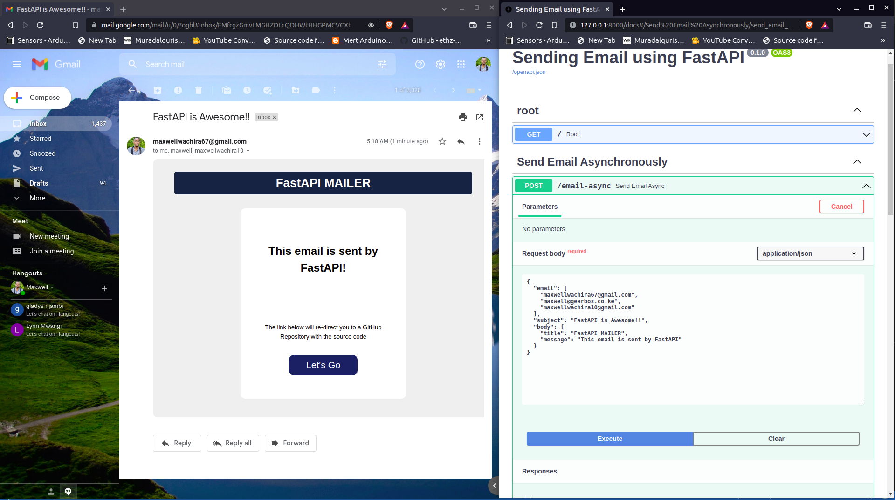

<h1 align="center"><b>Sending Email using FastAPI Mail
</b></h1>

[](https://github.com/maxwellwachira/FastAPI-Mail.git)

# Description

FastAPI-Mail is a simple lightweight mail system, sending emails and attachments(individual && bulk).
This project shows how to send emails both asynchronously and using Background Tasks.
The email body parameters are provided as the request body. These parameters are then used by the HTML email template 
<br>


# Table of contents
* [Prerequisites](#Prerequisites)
* [Directory Structure](#Directory-Structure)
* [Running Locally](#Setting-up-Local-Environment)
* [Acknowledgement](#Acknowledgement)
* [License](#License)


# Prerequisites
- [Python - version 3.7 and above ](https://www.python.org/)
- Turn on less secure app google. [Click here](https://hotter.io/docs/email-accounts/secure-app-gmail/) to follow a guide


# Directory-Structure
    FastAPI-Mail
    ├── app			             # contains app files 
    |   ├── models.py  
    |	└── send_mail.py  
    ├── templates
    |   ├── email
    |   |   └── email.html 
    |	└── landing_page.html 
	├── .env    
	├── main.py                  # Application entry point
    ├── requirements.txt		 # project dependencies
	└── README.md

# Setting-up-Local-Environment
### clone the repository and navigate to the project directory
```bash
git clone https://github.com/maxwellwachira/FastAPI-Mail.git
cd FastAPI-Mail/
```
### Create a python virtual environment and activate it
```bash
python3 -m venv venv
source venv/bin/activate
```
### Install Project dependencies
```bash
pip install -r requirements.txt
```
create a file and name it as .env. Copy contents of .env.example to .env 

# Acknowledgement
Special thanks to [sabuhish](https://sabuhish.github.io/fastapi-mail/) the author of fastapi-mail module.<br>
Special thanks to [Sebastián Ramírez aka @tiangolo](https://github.com/tiangolo) the creator of FastAPI 


## <b>License</b>
[](LICENSE)